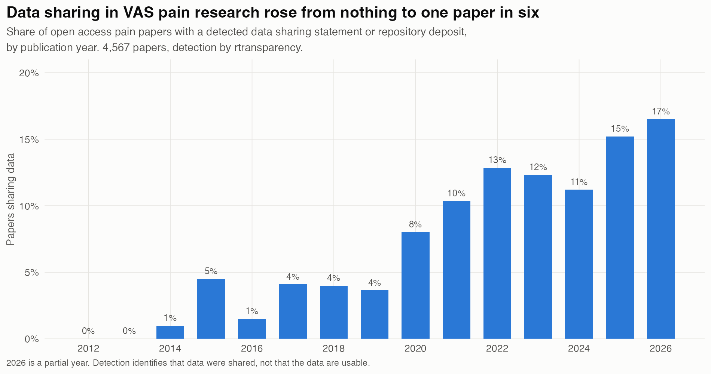
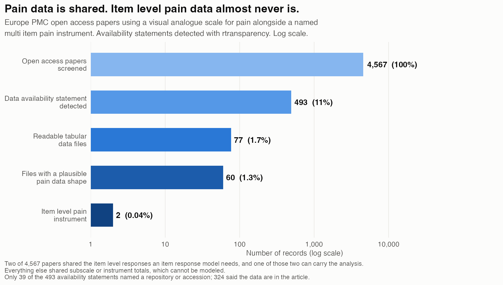
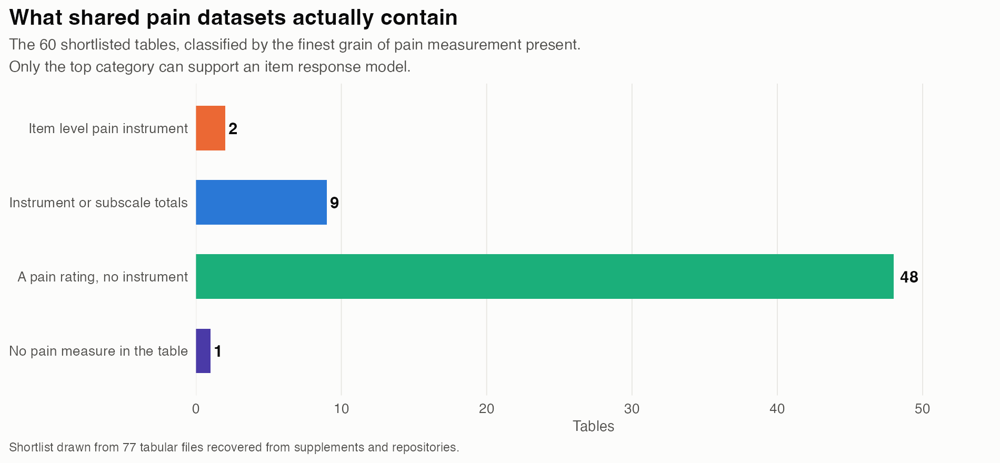
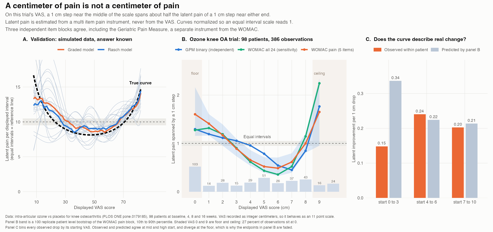

# Is the Visual Analogue Scale an Interval Scale?

## Stage 1: the search, and the first answer

**Date:** 11 September 2026
**Status:** search and screening complete; one admissible dataset found and analyzed.

---

## Summary

The plan was the pain analogue of the PISA score interval plot: estimate latent
pain from a multi item pain instrument, regress the displayed VAS on it with a
monotone spline, and show how much latent pain a fixed displayed interval
actually spans at each point on the scale.

**The answer, on the one dataset that could carry it, is that the VAS is not an
interval scale.** In a 98 patient knee osteoarthritis trial, a 1 cm step near the
middle of the scale spans about **half** the latent pain of a 1 cm step near
either end. Three independent item blocks agree, including the Geriatric Pain
Measure, which is a different instrument from the WOMAC. A patient level
bootstrap separates the middle of the scale from the low end with no overlap.

Getting there was the hard part. Of **4,567** open access papers that use a VAS
for pain alongside a named multi item pain instrument, **493** carry a data
availability statement, **two** share the item level responses an item response
model requires, and **one** of those two can carry the analysis. Everything else
shares subscale and instrument totals, which cannot be modeled.

That scarcity is a real finding about the research record rather than a failure
of the search, and it is the most useful thing to know before committing to this
project: the bottleneck is not finding papers, it is that pain researchers
deposit scores, not responses.

## What was done

### Search

Europe PMC, open access with full text in EPMC, 2012 to 2026. The query required
a visual analogue scale term, the word pain, and a named multi item pain
instrument, all in the abstract:

> Brief Pain Inventory, McGill Pain Questionnaire, WOMAC, KOOS, PROMIS, SF-MPQ,
> numeric rating scale, numerical rating scale, or pain intensity

Four strata were run and de-duplicated: a broad stratum taken to exhaustion
(4,581 hits), a supplementary material stratum, a body text stratum matching
repository names, and a journal policy stratum covering PLOS ONE, Scientific
Reports, BMJ Open and PeerJ. The journal policy stratum returned **zero** records
not already captured, which is reassuring about coverage: the journals with
mandatory data policies were already fully inside the net.

**4,570 unique PMC records.**

### Data sharing detection

Every record's full text XML was downloaded and passed through
`rtransparency::rt_data_code_pmc()`. 4,567 were processed successfully.

| | n | % of screened |
|---|---:|---:|
| Papers screened | 4,567 | 100% |
| Data availability statement detected | 493 | 10.8% |
| Code sharing detected | 36 | 0.8% |
| With a repository link (figshare, OSF, Zenodo, Dryad) | 41 | 0.9% |

Detection has risen steadily, from zero in 2012 and 2013 to 16.5% in 2026.

**What those 493 statements actually say matters more than the count.** The
detector reports that an availability statement exists, not that usable data sit
behind it:

| Statement type | n | % of the 493 |
|---|---:|---:|
| In the article or its supplement | 324 | 65.7% |
| Other wording | 130 | 26.4% |
| Names a repository or accession | 39 | 7.9% |

Two thirds point at the article itself, which is exactly where screening then
found subscale totals rather than item responses. Any headline rate quoted from
this corpus should say "availability statement detected", not "data shared".

{width=full}

### Retrieval and screening

Supplementary bundles were pulled from the Europe PMC `supplementaryFiles`
endpoint for every flagged paper, and repository links were resolved through the
figshare, Zenodo, OSF and Dryad APIs. **102 tabular files** were retrieved, **77**
of them machine readable, yielding **161 tables** once every sheet of every
workbook was scored separately.

Screening scores tables on *shape* rather than column name regexes, because real
shared files name the rating `PI`, `pain0` or `NRS` at least as often as `VAS`. A
table scores highly when it holds a wide 0 to 100 column alongside a block of
small integer columns, which is what an item level pain dataset looks like. That
produced a ranked review list of **60 tables**, which were then read by hand.

{width=full}

### What the 60 shortlisted tables contained

{width=full}

The shape heuristic did its job as a ranker, but hand review was decisive. Most
shortlisted tables earned their small integer columns from sex, ASA grade,
comorbidity flags and treatment arm, not from questionnaire items. A targeted
scan for the item block signatures of WOMAC, KOOS, SF-MPQ, BPI and PROMIS across
all 161 tables returned **7 hits**, of which 5 were subscale totals.

**Two datasets held genuine item level pain responses.**

---

## The result

### The dataset

**Intra-articular ozone versus placebo for knee osteoarthritis**, PLOS ONE
`pone.0179185`, the same study as PMC5524330 in the corpus. 98 patients,
assessed at baseline and at 4, 8 and 16 weeks, giving 386 observations. Openly
downloadable as an XLS supporting file under CC BY.

It carries, on the same people at the same moment:

- a pain **VAS**, recorded as integer centimeters, so it behaves as an 11 point
  scale rather than a continuous 100 mm line;
- the **WOMAC** as 24 individual items, each a five category Likert response
  stored as 0, 25, 50, 75 or 100;
- the **Geriatric Pain Measure** as 24 individual items, 22 of them yes or no.

Mean VAS falls from 7.3 at baseline to 2.8 at 16 weeks, so the cohort covers
almost the whole scale rather than piling into one corner.

**A correction.** This dataset was in the original corpus, was the top hit from
the instrument signature scan, and was rejected in the first pass on the grounds
that its WOMAC items were themselves visual analogue scales. That was an
inspection error. The items range from 0 to 100 but take only **five distinct
values**, which is a Likert response rescaled to percent. The number of distinct
values, not the range, was the tell. The screening pipeline surfaced this dataset
correctly; the hand review threw it away.

### How much latent pain does a 1 cm step span?

{page=landscape}

Normalized so that an equal interval scale reads 1.0 across the scale:

| Displayed VAS | WOMAC pain | GPM binary | WOMAC all 24 |
|---|---:|---:|---:|
| 1 | 1.41 | 1.19 | 1.32 |
| 2 | 1.17 | 1.11 | 1.19 |
| 3 | 0.89 | 1.05 | 0.90 |
| 4 | 0.66 | 0.96 | 0.62 |
| 5 | 0.52 | 0.79 | 0.43 |
| 6 | 0.49 | 0.54 | 0.36 |
| 7 | 0.61 | 0.45 | 0.52 |
| 8 | 1.00 | 0.85 | 1.14 |

The curve is U shaped. A 1 cm step from 5 to 6 carries roughly half the latent
pain of a 1 cm step from 1 to 2 or from 8 to 9. The patient level bootstrap puts
VAS 1 at 1.16 to 1.61 and VAS 6 at 0.32 to 0.71, which do not overlap.

The three item blocks were chosen to make the finding hard to explain away.
WOMAC pain is the on construct primary. The GPM binary block is a **separate
instrument** with a different response format, so its agreement is close to a
replication rather than a re fit. WOMAC all 24 adds stiffness and function, which
is off construct and is reported only to show the shape does not depend on which
items are used. All three correlate 0.77 to 0.80 with the VAS.

GPM items 19 and 20 are themselves 0 to 10 pain intensity ratings, correlating
0.998 and 0.882 with the VAS. They are displays, not items, and are excluded.
Four near constant binary items were also dropped, since an endorsement rate
below 5 percent gives an unstable slope at this sample size.

### Does the curve describe real change?

98 patients measured four times is a within person design, so the curve can be
checked against what actually happened to people rather than only against a
between person contrast. Every observed drop in VAS was binned by its starting
value, and the latent improvement per 1 cm of displayed drop compared with what
the cross sectional curve predicts:

| Starting VAS | n drops | Observed | Predicted by the curve |
|---|---:|---:|---:|
| 0 to 3 | 22 | 0.15 | 0.34 |
| 4 to 6 | 65 | 0.24 | 0.22 |
| 7 to 10 | 74 | 0.20 | 0.21 |

At mid and high starting values the curve predicts within person change well. At
the floor it over predicts by a factor of two, which is why VAS 0 and 9 are drawn
faded in the figure: 27 percent of all observations sit at VAS 0, and the
apparent stretching there mixes the VAS floor with the WOMAC floor. **The
interior finding does not depend on the endpoints.**

The practical consequence is the one that matters for trials. A protocol that
treats a 1 cm improvement as a fixed quantity is averaging steps that are not the
same size, and the mismatch is largest between the middle of the scale and its
ends.

### The second item level dataset, and why it is not used

**PMC10695107**, knee osteoarthritis, n = 57. Holds the WOMAC pain subscale as
five genuine 0 to 4 Likert items with a separate 0 to 100 VAS at baseline and six
weeks. Admissible in principle, but baseline VAS spans only 60 to 90 and six week
VAS spans 1 to 55. Stacking both occasions leaves a hole between 55 and 60, and
the fitted curve climbs from 8.3 to 24.5 as it crosses that empty stretch with a
bootstrap band of 12.9 to 32.2. It is a different display (0 to 100 rather than
0 to 10) at a fifth of the sample size, so it is not pooled with the ozone trial.

### Three datasets from a follow up deep research search

Delivered separately in `data/newdata/`, and screened the same way:

| Dataset | Verdict |
|---|---|
| PLOS ozone knee OA (`pone.0179185`) | **Admissible.** The analysis above. |
| Zenodo PEMF versus microwave knee OA (`Public data PEMF.sav`) | Rejected. WOMAC present as `PRE_WOMAC_P`, `_S`, `_F` and `TOTAL` only. Subscale totals, no items. |
| Figshare tDCS plus exercise knee pain | Rejected. KOOS stored as two percentages, plus four repeated pain ratings and four disability totals. No items. The file is an Excel workbook despite its `.csv` extension. |

Two of the three confirm the pattern the corpus search found: the instruments are
right, the deposited numbers are scores.

## Method

1. Fit a unidimensional IRT model to the multi item pain instrument, **excluding
   the VAS**. Both a graded response model and a Rasch model are fitted, so the
   figure can carry two bold lines the way the PISA plot does.
2. Take **WLE** factor scores as theta. EAP was rejected: it shrinks toward the
   prior mean, and hardest where test information is low, which is the tails.
   That would flatten the spline at both ends of the VAS and manufacture
   compression the scale does not have.
3. Regress theta on the displayed VAS with a monotone increasing spline
   (`scam`, `bs = "mpi"`).
4. `D(v) = f(v + w) - f(v)` is the latent distance spanned by a displayed
   interval of width w starting at v. Under an interval scale D is flat. On a
   0 to 100 VAS w is 10 points; on the ozone trial's 0 to 10 centimeter VAS the
   analogue is w = 1, and the spline uses k = 6 because there are only 11
   distinct x values to fit.
5. Rescale so that the mean of D across the 5th to 95th percentile of the
   observed VAS distribution equals 10, so the curve reads directly as a ruler.
   Normalizing over the full 0 to 90 grid would let empty tails dominate.

Two contamination guards matter. Any column named as a visual analogue scale is
barred from the item block, and so is any column correlating above 0.95 with the
chosen display, which catches the same rating recorded twice in different units.
BPI severity items are deliberately **not** barred despite being named
`pain_worst` and `pain_now`: the graded model frees every item threshold, so a
0 to 10 item response is not assumed linear in latent pain, and excluding them
would delete the best instrument in the corpus.

Repeated measures of one item are not items. A dataset whose proposed item block
is mostly timepoint suffixed is flagged and refused unless explicitly overridden,
or theta becomes average pain over the trial rather than pain at the moment the
rating was given.

### Validation

`Rscript R/04_interval_curve.R` runs a self check: it simulates a display with
known top end compression and asserts the estimator recovers an increasing
interval curve with the normalization intact. It covers both the graded and the
Rasch path.

---

## What this means for the project

There is now a real result from one trial. What it needs is replication, and the
corpus search says replication will not come from journal supplements. Three
routes, in order of cost:

1. **Cohorts that deposit item level data by design.** The Osteoarthritis
   Initiative and MOST both hold WOMAC at item level alongside pain ratings, at
   sample sizes three orders of magnitude above this one. Both need a data use
   agreement rather than a download. This is the fastest route to a second
   independent curve, and to one measured on a continuous 0 to 100 VAS rather
   than integer centimeters.

   A direct search of Zenodo, Dryad and OSF by instrument name
   (`R/08_repo_search.R`, results in `out/repo_search_hits.csv`) surfaced five
   further human pain datasets worth opening by hand, including a Dryad deposit
   on staged bilateral knee arthroplasty pain and an OSF item content analysis of
   the Brief Pain Inventory interference subscale.

2. **Ask authors directly.** PMC10695107 has admissible items and only needs more
   participants. The follow up deep research search also flagged a Gulf War
   Veterans resistance exercise trial with an explicit 0 to 100 VAS and SF-MPQ at
   six timepoints, whose deposited object is a DOCX rather than a data table;
   that is one email away from being usable.

3. **The psychophysics design.** Controlled thermal or pressure stimuli with
   pairwise comparisons, building the latent scale from a Bradley-Terry model
   rather than from another questionnaire. The most convincing version of the
   study and the most expensive.

The single most valuable replication would be on a VAS recorded as a continuous
100 mm measurement. This trial's VAS was stored as integer centimeters, so what
is demonstrated is that an 11 point VAS is not an interval scale. Whether a
genuinely continuous 100 mm line behaves the same way is the obvious next
question, and the shape of the curve here predicts that it should.

There is also a second paper sitting in this output that needs no new data: of
4,567 open access pain papers, 10.8 percent carry a data availability statement,
7.9 percent of those name a repository, and 0.04 percent share the item level
responses required to re-analyze a psychometric question. Sharing rates are
measured, rising, and precisely quantified here. That is a meta-research result
in its own right.

## Caveat carried from the design

The curve measures VAS intervals relative to the IRT logit metric. That metric is
itself a modeling choice, the same assumption the PISA plot makes. It is the
comparison that is informative, not the absolute units.

## Reproducing

```
Rscript R/01_search.R          # Europe PMC, three strata
Rscript R/01b_search_plos.R    # journal policy stratum
Rscript R/01c_search_rest.R    # exhaust the broad stratum
Rscript R/02_flag.R            # XML download, rtransparency detection
Rscript R/02b_flag_extra.R
Rscript R/03_screen.R          # supplements, shape scoring, review list
Rscript R/03b_repos.R          # figshare, Zenodo, OSF, Dryad
Rscript R/08_repo_search.R     # direct repository search by instrument
Rscript R/04_interval_curve.R  # estimator plus self check
Rscript R/07_run.R             # curated analysis
Rscript R/09_figures.R         # figures 1 to 3
Rscript R/11_ozone.R           # the analysis of the admissible dataset
Rscript R/12_figure_ozone.R    # the main figure
```

`data/` is gitignored. Downloaded datasets stay local and keep their original
licenses and citations.
