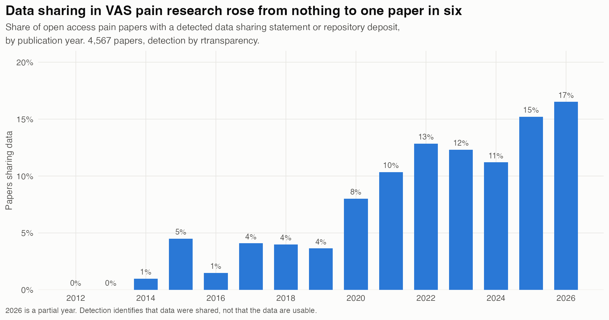
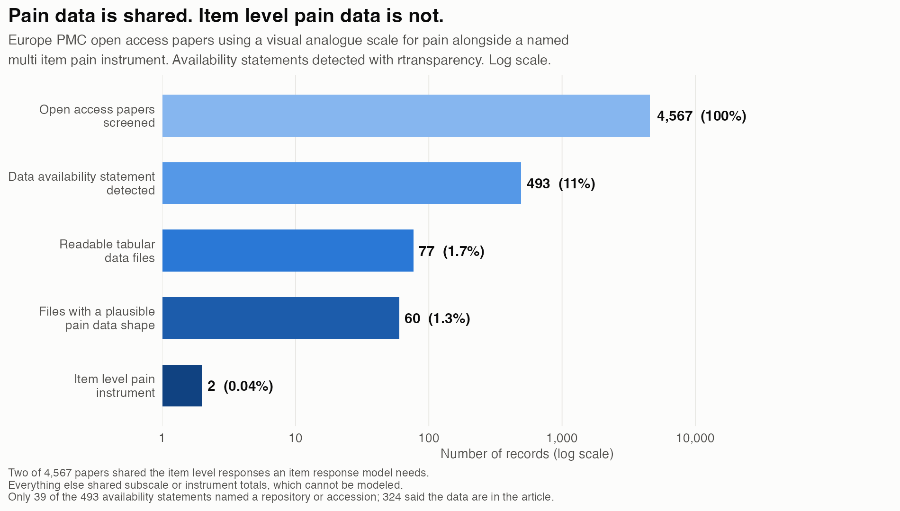
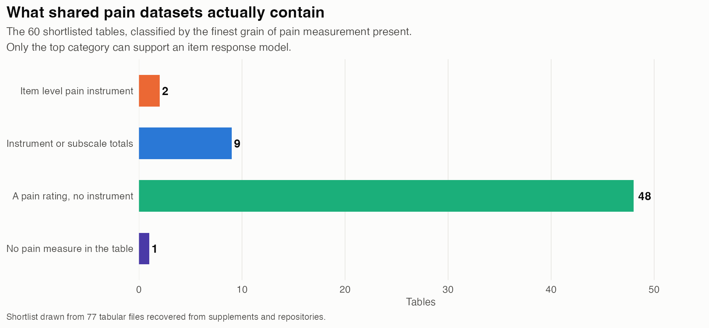
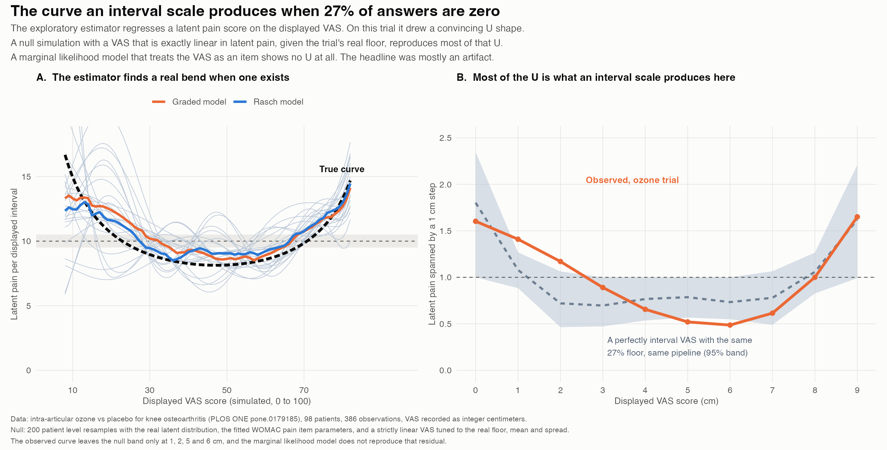

# Is the Visual Analogue Scale an Interval Scale?

## Stage 1: the search, one dataset, and a correction

**Date:** 27 September 2026
**Status:** search and screening complete; one admissible dataset analyzed. An
earlier version of this report claimed the VAS is not an interval scale. That
claim does not survive a null simulation and is withdrawn; see Robustness.

---

## Summary

The plan was the pain analogue of the PISA score interval plot: estimate latent
pain from a multi item pain instrument, relate the displayed VAS to it, and show
how much latent pain a fixed displayed interval spans at each point on the scale.

**Three findings survive.**

1. **Item level pain data is almost never shared.** Of **4,567** open access
   papers that use a VAS for pain alongside a named multi item pain instrument,
   **493** carry a data availability statement, **two** share item level
   responses, and **one** can carry the analysis.

2. **The quick method manufactures the answer.** On that one dataset, a 98
   patient knee osteoarthritis trial, the exploratory estimator (regress a
   latent score on the displayed VAS, then difference the fitted curve) drew a
   convincing U shape: a 1 cm step mid scale appeared to span half the latent
   pain of a step near either end. A null simulation with a VAS that is exactly
   linear in latent pain, given the trial's real 27 percent floor, reproduces
   most of that U through the same pipeline. A marginal likelihood model that
   treats the VAS as an item shows no U at all. **The headline was mostly an
   artifact of the floor.**

3. **This trial's VAS was recorded as integer centimeters with uneven use of
   the numbers.** Counts at 3 and 9 cm run at about half their neighbors, which
   is consistent with digit preference. That is a property of how this VAS was
   recorded, not evidence about a continuous 100 mm line.

**What is not answered:** whether a genuinely continuous VAS is an interval
scale. That needs item level data with the VAS recorded in millimeters, which the
open literature searched here does not contain.

The practical lesson generalizes beyond pain: anyone reproducing the PISA style
interval plot on a scale with a floor or ceiling should run a floor matched null
before reading the curve.

## What was done

### Search

Europe PMC, open access with full text in EPMC, 2012 to 2026. The query required
a visual analogue scale term, the word pain, and a named multi item pain
instrument, all in the abstract:

> Brief Pain Inventory, McGill Pain Questionnaire, WOMAC, KOOS, PROMIS, SF-MPQ,
> numeric rating scale, numerical rating scale, or pain intensity

Four strata were run and de-duplicated: a broad stratum taken to exhaustion
(4,581 hits), a supplementary material stratum, a body text stratum matching
repository names, and a journal policy stratum covering PLOS ONE, Scientific
Reports, BMJ Open and PeerJ. The journal policy stratum returned **zero** records
not already captured, which is reassuring about coverage: the journals with
mandatory data policies were already fully inside the net.

**4,570 unique PMC records.**

### Data sharing detection

Every record's full text XML was downloaded and passed through
`rtransparency::rt_data_code_pmc()`. 4,567 were processed successfully.

| | n | % of screened |
|---|---:|---:|
| Papers screened | 4,567 | 100% |
| Data availability statement detected | 493 | 10.8% |
| Code sharing detected | 36 | 0.8% |
| With a repository link (figshare, OSF, Zenodo, Dryad) | 41 | 0.9% |

Detection has risen steadily, from zero in 2012 and 2013 to 16.5% in 2026.

**What those 493 statements actually say matters more than the count.** The
detector reports that an availability statement exists, not that usable data sit
behind it:

| Statement type | n | % of the 493 |
|---|---:|---:|
| In the article or its supplement | 324 | 65.7% |
| Other wording | 130 | 26.4% |
| Names a repository or accession | 39 | 7.9% |

Two thirds point at the article itself, which is exactly where screening then
found subscale totals rather than item responses. Any headline rate quoted from
this corpus should say "availability statement detected", not "data shared".

{width=full}

### Retrieval and screening

Supplementary bundles were pulled from the Europe PMC `supplementaryFiles`
endpoint for every flagged paper, and repository links were resolved through the
figshare, Zenodo, OSF and Dryad APIs. **102 tabular files** were retrieved, **77**
of them machine readable, yielding **161 tables** once every sheet of every
workbook was scored separately.

Screening scores tables on *shape* rather than column name regexes, because real
shared files name the rating `PI`, `pain0` or `NRS` at least as often as `VAS`. A
table scores highly when it holds a wide 0 to 100 column alongside a block of
small integer columns, which is what an item level pain dataset looks like. That
produced a ranked review list of **60 tables**, which were then read by hand.

{width=full}

### What the 60 shortlisted tables contained

{width=full}

The shape heuristic did its job as a ranker, but hand review was decisive. Most
shortlisted tables earned their small integer columns from sex, ASA grade,
comorbidity flags and treatment arm, not from questionnaire items. A targeted
scan for the item block signatures of WOMAC, KOOS, SF-MPQ, BPI and PROMIS across
all 161 tables returned **7 hits**, of which 5 were subscale totals.

**Two datasets held genuine item level pain responses.**

---

## The one admissible dataset

**Intra-articular ozone versus placebo for knee osteoarthritis**, PLOS ONE
`pone.0179185`, the same study as PMC5524330 in the corpus. 98 patients at
baseline and 4, 8 and 16 weeks, 386 observations, openly downloadable under CC BY.
On the same people at the same visit it carries a pain VAS stored as integer
centimeters (so an 11 point scale), the WOMAC as 24 items each on a five category
Likert response stored as 0, 25, 50, 75 or 100, and the Geriatric Pain Measure
as 24 items, 22 of them yes or no. Mean VAS falls from 7.3 at baseline to 2.8 at
16 weeks, and 27 percent of all observations are exactly 0.

This dataset was rejected in the first screening pass because its WOMAC items
range from 0 to 100, which was misread as a visual analogue format. The items
take only five distinct values; the number of distinct values, not the range, was
the tell.

For a measurement question the trial's randomization and blinding are
irrelevant. What matters is how the VAS was recorded, and the integer storage
and the floor both turn out to matter a great deal.

## What the exploratory estimator showed

Latent pain was estimated from WOMAC pain items (and separately from the GPM and
from all 24 WOMAC items) by weighted likelihood, never using the VAS. A monotone
spline of that estimate on the VAS was differenced at 1 cm steps and normalized
so that an equal interval scale reads 1.0:

| Displayed VAS | 1 | 2 | 3 | 4 | 5 | 6 | 7 | 8 |
|---|---:|---:|---:|---:|---:|---:|---:|---:|
| WOMAC pain | 1.41 | 1.17 | 0.89 | 0.66 | 0.52 | 0.49 | 0.61 | 1.00 |
| GPM binary | 1.19 | 1.11 | 1.05 | 0.96 | 0.79 | 0.54 | 0.45 | 0.85 |

Three item blocks gave the same U shape, and a patient level bootstrap separated
the middle of the scale from the low end. The previous version of this report
published that as the result. It is not.

## Robustness

{page=landscape}

Each check below targets a way the curve could appear without the VAS being
anything other than interval.

**A. Naive null.** A VAS exactly linear in latent pain, real latent distribution,
real item parameters, same pipeline, 200 patient level resamples. The null curve
is flat (median 1.00 at every point) and the observed contrast D(1,2) / D(5,6) of
2.56 exceeds every null replicate. But this null produced 12 percent zeros where
the data have 27 percent, so it is the wrong null.

**A2. Floor matched null.** The same linear VAS re-tuned to match the real floor
(26.9 percent), mean and spread. Now the null itself bends into a U: median D is
1.80 at 0, 1.08 at 1, 0.70 to 0.79 across 2 to 7, 1.06 at 8 and 1.62 at 9. The
observed curve leaves the 95 percent null band only at 1, 2, 5 and 6 cm. This
null also correlates 0.86 with the latent estimate against 0.79 in the real
data, so it carries less VAS noise than reality and likely understates the
artifact. **Most of the published U is what a perfectly interval VAS produces on
data with this floor.** The mechanism: regressing a latent score on a noisy
displayed score bends the fitted curve wherever the displayed scores pile up.

**B. Raw sum scores show the low arm too.** The same curve drawn for each
instrument's own raw total, against the other instrument's latent metric, is
steep at the bottom (WOMAC pain sum 2.92, GPM sum 3.46 in the lowest fifth,
falling toward 1.1 to 1.5 at the top). The low arm of the U is a property of the
latent reference metric, not of the VAS.

**Within patient change.** Binning every observed VAS drop by its starting value,
the curve predicted a latent improvement per centimeter of 0.34 from a start of
0 to 3; patients actually showed 0.15. The low arm fails within people as well.

**C. The VAS as an anchored item.** The WOMAC pain items were calibrated without
the VAS, fixed, and the VAS added as an 11 category graded item, so its
thresholds are estimated by marginal likelihood with latent pain integrated out.
Relative category widths for 1 to 9 cm: 0.57, 1.04, 0.50, 0.90, 1.41, 0.69,
1.10, 1.80, 1.13. **No U.** The low versus middle contrast is 0.76 (patient
bootstrap 95 percent 0.52 to 0.99), the opposite direction from the exploratory
curve, and 0.97 with an empirical histogram latent density.

**C1. That estimator is unbiased under the floor matched null.** On 60 simulated
datasets with a linear VAS and the real floor, it returned widths with medians of
0.95 to 1.08 and a contrast median of 0.96.

**C2, and the limit of C.** Anchoring on the GPM instead of the WOMAC returns
identical widths (correlation 1.00). That agreement is mechanical rather than a
replication: the widths correlate 0.976 with a plain normal quantile transform
of the VAS response counts. With a single highly discriminating item and an
assumed normal latent density, the thresholds are fixed mostly by the item's own
response distribution. So C reliably says there is no U; its specific width
profile mostly restates how often each number was used.

**How often each number was used.** VAS counts at 0 to 10 cm are 103, 14, 28, 15,
29, 51, 26, 37, 43, 16, 24. The counts at 3 and 9 cm run at about half the
average of their neighbors. That is consistent with digit preference in an
integer recorded scale. The WOMAC pain sum is also lumpy (68 at 0, local peaks at
4 and 10 of 20), so the claim stays at "consistent with".

### The second item level dataset

**PMC10695107**, knee osteoarthritis, n = 57, WOMAC pain as five 0 to 4 Likert
items and a 0 to 100 VAS at baseline and six weeks. Baseline VAS spans only 60 to
90 and six week VAS spans 1 to 55; the curve climbs from 8.3 to 24.5 across the
gap between them with a bootstrap band of 12.9 to 32.2. Not analyzable.

### Three datasets from a follow up deep research search

| Dataset | Verdict |
|---|---|
| PLOS ozone knee OA (`pone.0179185`) | Admissible. The analysis above. |
| Zenodo PEMF versus microwave knee OA (`Public data PEMF.sav`) | Rejected. WOMAC present as `PRE_WOMAC_P`, `_S`, `_F` and `TOTAL` only. |
| Figshare tDCS plus exercise knee pain | Rejected. KOOS stored as two percentages, plus repeated pain and disability totals. The file is an Excel workbook despite its `.csv` extension. |

## Method

1. Fit a unidimensional IRT model to the multi item pain instrument, **excluding
   the VAS**. Both a graded response model and a Rasch model are fitted, so the
   figure can carry two bold lines the way the PISA plot does.
2. Take **WLE** factor scores as theta. EAP was rejected: it shrinks toward the
   prior mean, and hardest where test information is low, which is the tails.
   That would flatten the spline at both ends of the VAS and manufacture
   compression the scale does not have.
3. Regress theta on the displayed VAS with a monotone increasing spline
   (`scam`, `bs = "mpi"`).
4. `D(v) = f(v + w) - f(v)` is the latent distance spanned by a displayed
   interval of width w starting at v. Under an interval scale D is flat. On a
   0 to 100 VAS w is 10 points; on the ozone trial's 0 to 10 centimeter VAS the
   analogue is w = 1, and the spline uses k = 6 because there are only 11
   distinct x values to fit.
5. Rescale so that the mean of D across the 5th to 95th percentile of the
   observed VAS distribution equals 10, so the curve reads directly as a ruler.
   Normalizing over the full 0 to 90 grid would let empty tails dominate.

Steps 1 to 5 are the **exploratory estimator**. On data with a floor it is
biased, as the Robustness section shows, so any curve it draws must be read
against a floor matched null. The **preferred estimator** treats the VAS as an
item: calibrate the anchor instrument without the VAS, fix its parameters, add
the VAS as a graded item, and read the category widths off its thresholds. Its
limit is that with one item and an assumed latent density the widths largely
restate the VAS response distribution, so it is better at ruling a shape out
than at pinning a width profile down.

Two contamination guards matter. Any column named as a visual analogue scale is
barred from the item block, and so is any column correlating above 0.95 with the
chosen display, which catches the same rating recorded twice in different units.
BPI severity items are deliberately **not** barred despite being named
`pain_worst` and `pain_now`: the graded model frees every item threshold, so a
0 to 10 item response is not assumed linear in latent pain, and excluding them
would delete the best instrument in the corpus.

Repeated measures of one item are not items. A dataset whose proposed item block
is mostly timepoint suffixed is flagged and refused unless explicitly overridden,
or theta becomes average pain over the trial rather than pain at the moment the
rating was given.

### Validation

`Rscript R/04_interval_curve.R` runs a self check: it simulates a display with
known top end compression and asserts the estimator recovers an increasing
interval curve with the normalization intact. It covers both the graded and the
Rasch path.

---

## What this means for the project

The interval question is still open. What it needs is a dataset with item level
responses and a VAS recorded in millimeters, analyzed with the marginal likelihood
model and checked against a floor matched null. The corpus search says that data
will not come from journal supplements. Three routes, in order of cost:

1. **Cohorts that deposit item level data by design.** The Osteoarthritis
   Initiative and MOST both hold WOMAC at item level alongside pain ratings, at
   sample sizes three orders of magnitude above this one. Both need a data use
   agreement rather than a download. Check first whether their pain rating is a
   continuous VAS or a 0 to 10 numeric scale.

   A direct search of Zenodo, Dryad and OSF by instrument name
   (`R/08_repo_search.R`, results in `out/repo_search_hits.csv`) surfaced five
   further human pain datasets worth opening by hand, including a Dryad deposit
   on staged bilateral knee arthroplasty pain and an OSF item content analysis of
   the Brief Pain Inventory interference subscale.

2. **Ask authors directly.** PMC10695107 has admissible items and only needs more
   participants. The follow up deep research search also flagged a Gulf War
   Veterans resistance exercise trial with an explicit 0 to 100 VAS and SF-MPQ at
   six timepoints, whose deposited object is a DOCX rather than a data table;
   that is one email away from being usable.

3. **The psychophysics design.** Controlled thermal or pressure stimuli with
   pairwise comparisons, building the latent scale from a Bradley-Terry model
   rather than from another questionnaire. The most convincing version of the
   study and the most expensive.

There is also a second paper sitting in this output that needs no new data: of
4,567 open access pain papers, 10.8 percent carry a data availability statement,
7.9 percent of those name a repository, and 0.04 percent share the item level
responses required to re-analyze a psychometric question. Sharing rates are
measured, rising, and precisely quantified here. That is a meta-research result
in its own right.

## Caveat carried from the design

The curve measures VAS intervals relative to the IRT logit metric. That metric is
itself a modeling choice, the same assumption the PISA plot makes. It is the
comparison that is informative, not the absolute units.

## Reproducing

```
Rscript R/01_search.R          # Europe PMC, three strata
Rscript R/01b_search_plos.R    # journal policy stratum
Rscript R/01c_search_rest.R    # exhaust the broad stratum
Rscript R/02_flag.R            # XML download, rtransparency detection
Rscript R/02b_flag_extra.R
Rscript R/03_screen.R          # supplements, shape scoring, review list
Rscript R/03b_repos.R          # figshare, Zenodo, OSF, Dryad
Rscript R/08_repo_search.R     # direct repository search by instrument
Rscript R/04_interval_curve.R  # estimator plus self check
Rscript R/07_run.R             # curated analysis
Rscript R/09_figures.R         # figures 1 to 3
Rscript R/11_ozone.R           # exploratory estimator on the admissible dataset
Rscript R/13_robustness.R      # naive null and sum score benchmark
Rscript R/14_anchored.R        # floor matched null and VAS as an anchored item
Rscript R/15_anchored_checks.R # anchored estimator under the null, GPM anchor
Rscript R/12_figure_ozone.R    # the main figure
```

`data/` is gitignored. Downloaded datasets stay local and keep their original
licenses and citations.
